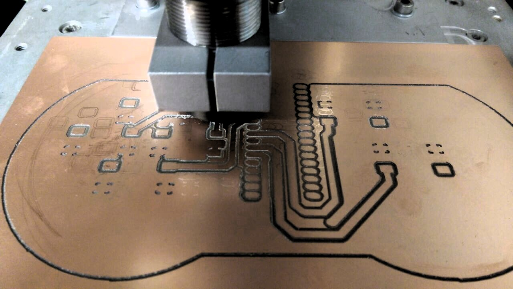
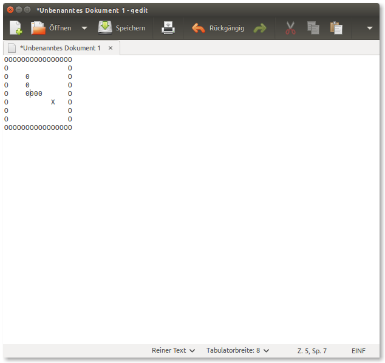

MicroGame
=========
In this repository you find the firmware and hardware design for the
"MicroGame", an open-source game based on the keyboard function of the Arduino Micro.

Snake
-----

'0' -> Snake
'X' -> Targel
'O' -> Border

Tetris
------
Coming soon.
